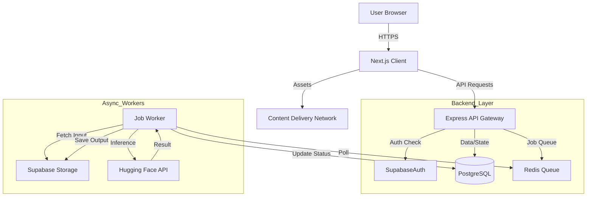

# ArtMorph: Context-Aware Image Transformation Engine - Technical Specification

## 1. Product Vision
**ArtMorph** is a professional-grade, structure-preserving image transformation engine designed for creators, storyboard artists, and designers who require precision over randomness. It allows users to re-skin their concepts into specific styles without losing the original pose, depth, or layout.

## 2. High-Level System Architecture



## 3. Technology Stack

*   **Frontend**: Next.js 14+ (App Router), TypeScript, Tailwind CSS, Lucide React, Zustand (State), Framer Motion.
*   **Backend**: Node.js, Express.js, BullMQ (Queue), Redis, Multer.
*   **Database & Auth**: Supabase (PostgreSQL, GoTrue, Storage).
*   **AI Inference**: Hugging Face Inference API (Stable Diffusion + ControlNet).
*   **Infrastructure**: Vercel (Frontend), Railway/Render (Backend), Supabase.

## 4. Project Structure

```text
artmorph/
├── client/                 # Next.js Frontend
│   ├── app/                # App Router
│   ├── components/         # Atomic UI Components
│   ├── lib/                # API clients, utils
│   ├── store/              # Zustand stores
│   └── types/              # TS Interfaces
├── server/                 # Express Backend
│   ├── src/
│   │   ├── config/         # Environment variables
│   │   ├── controllers/    # Route handlers
│   │   ├── middlewares/    # Auth, Validation
│   │   ├── routes/         # API structure
│   │   ├── services/       # AI & DB Wrappers
│   │   ├── workers/        # BullMQ Job Processors
│   │   └── styles/         # JSON Style Configurations
│   └── package.json
└── README.md
```

## 5. Database Schema (PostgreSQL on Supabase)

### `profiles` (Extends `auth.users`)
| Column | Type | Description |
| :--- | :--- | :--- |
| `id` | `uuid` | PK, References `auth.users.id` |
| `email` | `text` | User email address |
| `daily_generations_count` | `int` | Tracks daily usage (Default: 0) |
| `last_reset_timestamp` | `timestamptz` | For daily limit reset logic |

### `generations` (Job History)
| Column | Type | Description |
| :--- | :--- | :--- |
| `id` | `uuid` | PK, Unique Job ID |
| `user_id` | `uuid` | FK, References `profiles.id` |
| `status` | `enum` | `QUEUED`, `PROCESSING`, `COMPLETED`, `FAILED` |
| `style_id` | `text` | ID of style config used |
| `input_image_path` | `text` | Storage path (private bucket) |
| `output_image_path` | `text` | Storage path (nullable until complete) |
| `error_message` | `text` | Failure reason if applicable |
| `created_at` | `timestamptz` | Submission time |

### `style_sections` & `style_configs`
(Can be static JSON in backend code for simplicity, or DB tables for dynamic updates).

## 6. Backend API Specification

| Method | Endpoint | Description |
| :--- | :--- | :--- |
| `GET` | `/api/user/profile` | Get credit usage and basic info |
| `GET` | `/api/user/history` | Get paginated list of past generations |
| `GET` | `/api/styles` | Get available sections and styles |
| `POST` | `/api/generate` | Start a job. Body: `{ input_image, style_id, prompt }` |
| `GET` | `/api/generate/:id` | Poll single job status |

## 7. Authentication Flow (Supabase)

1.  **Client**: User logs in via Supabase Auth UI (frontend).
2.  **Turnstile**: Supabase returns a JWT (Access Token).
3.  **Request**: Client sends `Authorization: Bearer <JWT>` to Express Backend.
4.  **Verification**: Express Middleware verifies JWT signature using Supabase Project Secret.
5.  **Access**: If valid, request proceeds to Controllers.

## 8. Image Generation Pipeline

1.  **Ingestion**: User uploads image. Frontend resizes to rigid constraints (512x512, 512x768). Image stored in `temp_inputs`.
2.  **Job Creation**: API creates `generation` record (`QUEUED`) and adds job to BullMQ.
3.  **Processing**:
    *   Worker reads Job ID.
    *   Selects **Style Config** (e.g., "Cinematic").
    *   Constructs Prompts: `[Config Prefix] + [User Context] + [Config Suffix]`.
    *   Calls **Hugging Face Inference API** with:
        *   `inputs`: Positive Prompt
        *   `image`: Input Image
        *   `controlnet_model`: Defined in Config (e.g., `lllyasviel/sd-controlnet-canny`)
        *   `controlnet_conditioning_scale`: Defined in Config (e.g., 0.8)
4.  **Completion**: Output saved to `user_generations` bucket. DB record updated to `COMPLETED`. User credits deducted.

## 9. Style Configuration System (JSON Structure)

Styles are configuration objects, not distinct models.

```json
{
  "id": "cinematic-noir",
  "name": "Film Noir",
  "section": "Cinematic",
  "base_model": "stable-diffusion-v1-5",
  "controlnet": {
    "module": "depth",
    "weight": 0.85
  },
  "params": {
    "prompt_prefix": "black and white, high contrast, dramatic shadows, 50mm lens",
    "prompt_suffix": "grain, classic film, masterpiece",
    "negative_prompt": "color, cartoon, anime, bright lights",
    "guidance_scale": 7.5,
    "strength": 0.75
  }
}
```

## 10. Frontend UX Breakdown

*   **Theme**: Dark mode default (`#111111`) with minimal animations.
*   **Wizard Flow**:
    1.  **Upload**: Dropzone with immediate aspect-ratio check.
    2.  **Select Section**: "Cinematic", "Art", "Illustration" (High-level intent).
    3.  **Select Style**: Visual grid of specific looks within the section.
    4.  **Context**: Optional text input for scene modification.
    5.  **Generate**: Async modal with distinct states (Queue -> Process -> Result).
*   **Profile**: Usage tracking and gallery of previous works.
